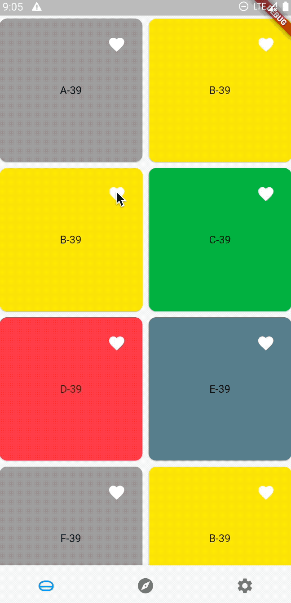
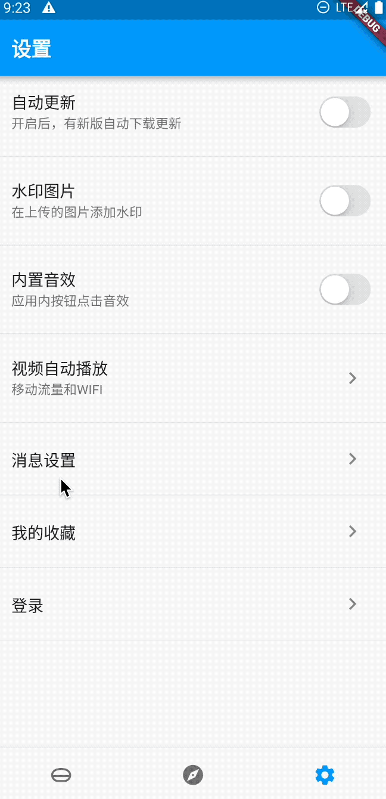

# provider状态管理+fluro路由封装

provider状态管理+fluro路由封装

## Getting Started

provider状态管理相关文章
- [Flutter-状态管理-provider-ChangeNotifierProvider的用法](https://blog.csdn.net/wu996489865/article/details/123947642)
- [Flutter状态管理-多页面收藏同步](https://blog.csdn.net/wu996489865/article/details/124068768)

fluro路由封装相关文章

